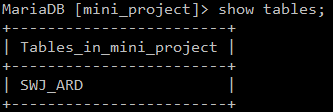
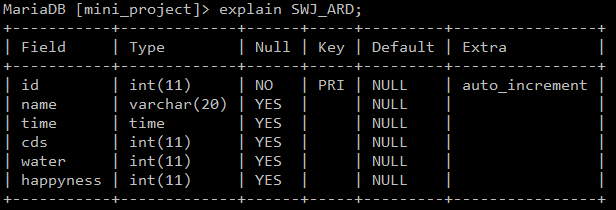
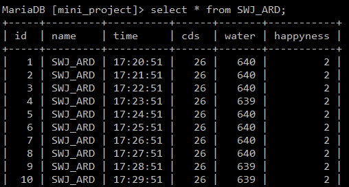

# 🍓 Raspberry Pi IoT Socket Server (Server + BlueTooth Client + MariaDB Client + Web)

라즈베리파이에서 운영하던 **멀티클라이언트 TCP 서버**, **Bluetooth↔TCP 브릿지 클라이언트**, **MariaDB 연동 클라이언트**, **웹(PHP) 뷰** 정리입니다.

---

## 📦 디렉터리 구조

iot_socket/  
├─ **iot_server/**  
│ ├─ iot_server_swj.c # 🖥 멀티클라이언트 TCP 서버  
│ ├─ Makefile  
│ └─ idpasswd.txt # 로그인 정보 SWJ_SQL PASSWD  
│  
├─ **iot_client_Bluetooth/**  
│ ├─ iot_client_bluetooth.c 
│ ├─ build_bt.sh  
│ └─ iot_client_bluetooth 
│  
└─ **iot_client_mariadb/**  
├─ sql_client/  
│ ├─ iot_client_device.c  
│ ├─ iot_client_sensor.c  
│ └─ project/  
│ ├─ iot_client_device_swj.c  
│ └─ Makefile
└─ html/  
├─ sensorTable.php # DB → 테이블 출력  
├─ sensorGraph.php # DB → Google Charts  
├─ index.html  
└─ phpinfo.php  

## 🧭 전체 아키텍처

[Raspberry Pi BT Client] ⇄ [HC-06/Arduino]  
│  
└──────(TCP)────→ [IoT Server]  
│  
┌─────┴──────┐  
│ │  
[MariaDB Client(s)] [Web PHP]  
│ │  
INSERT/SELECT 조회/시각화  
▼ ▼  
MariaDB ←─ sensorTable.php / sensorGraph.php  

---

## 🔐 로그인/프로토콜

- **초기 로그인**: 클라이언트는 접속 직후 **한 줄** 전송  
  `"[<ID>:<PW>]\n"`  (예: `"[SWJ_SQL:PASSWD]\n"`)
- **서버 계정 파일**: `iot_server/idpasswd.txt`  

```
------- idpasswd.txt -------

SWJ_STM PASSWD
SWJ_BLUE PASSWD
SWJ_SQL PASSWD
```

- 클라이언트 접속 명령
```
./<client> <SERVER_IP> <port> <LOGIN_ID>
```
---

## 🖥 IoT 서버 (TCP)

- 소스: `iot_server/iot_server_swj.c`
- 빌드:
```bash
cd iot_socket/iot_server
make              # iot_server_swj 생성 (pthread 링크)

./iot_server_swj <PORT>
# 예) ./iot_server_swj 5000
```

---

## 🗄 MariaDB 클라이언트

- 소스: `iot_client_mariadb/sql_client/iot_client_sensor.c`

- 데이터베이스 테이블 이름  

- 데이터베이스 테이블 구조  

- 데이터베이스에 저장되는 결과  


---

## 🔵 Bluetooth 브릿지 클라이언트

- 소스: iot_client_Bluetooth/iot_client_bluetooth.c
- 빌드:
```bash
./build_bt.sh
```
- 실행:
```bash
./iot_client_bluetooth <SERVER_IP> <PORT> <NAME>
```